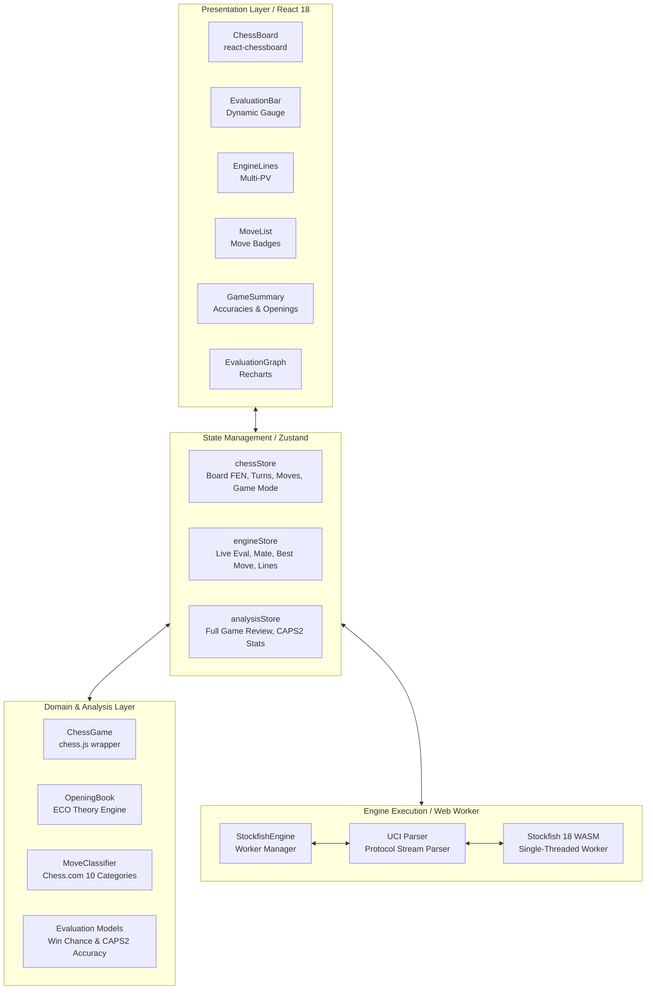
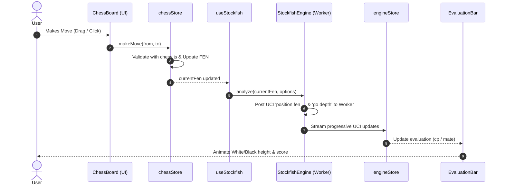

# ChessAnalyzer

[](https://react.dev/)
[](https://www.typescriptlang.org/)
[](https://vitejs.dev/)
[](https://stockfishchess.org/)
[](https://github.com/jhlywa/chess.js)
[](https://github.com/pmndrs/zustand)
[](https://vitest.dev/)
[](https://vercel.com/)
[](https://github.com/tanishpal23)

A modern, fast, and feature-rich real-time chess analysis and gameplay web application powered by **Stockfish 18 WASM** and **React**. 

Analyze your chess games directly in the browser with no backend required—100% client-side, private, and lightning-fast.

---

## Features

### Real-Time Engine Analysis
- **Stockfish 18 WASM Engine**: Runs entirely inside a client-side Web Worker using lightweight single-threaded WebAssembly.
- **Dynamic Evaluation Bar**: Real-time visual evaluation gauge displaying centipawns and mate counters from White or Black's perspective.
- **Multi-PV Engine Lines**: View top engine variations and principal variations (PV) translated into standard algebraic notation (SAN).
- **Best Move Arrow**: Real-time on-board vector arrows pointing out the best tactical moves.
- **Engine Power Toggle**: Instant ON/OFF switch to pause/resume engine calculation to conserve CPU and battery.

### Play vs Stockfish
- **5 Difficulty Levels**:
  - **Beginner** (800 Elo)
  - **Casual** (1200 Elo)
  - **Intermediate** (1600 Elo)
  - **Advanced** (2000 Elo)
  - **Master** (2500+ Elo)
- **Natural Cadence**: Calibrated search depth and `movetime` limits for human-like response times without freezes.
- **Play as White or Black**: Supports board orientation flipping; engine automatically initiates opening moves when playing as Black.
- **Turn State Indicators**: Real-time status indicators ("Stockfish is thinking…", "Your turn").

### Opening Theory & Book Moves
- **Real-Time ECO Recognition**: Dynamically detects openings and variations as moves are played (e.g. `📖 C50 • Italian Game: Giuoco Piano`).
- **110+ Opening Variations**: Curated opening theory database spanning 1-ply base moves up to 24 plies (12 full moves) across Sicilian (Najdorf, Dragon, Sveshnikov, Alapin), French, Caro-Kann, Ruy Lopez, Italian, Queen's Gambit, London System, King's Indian, English, and more.
- **$O(1)$ Prefix Set Indexing**: High-performance instant prefix hash lookups to detect if any played move sequence follows book theory.
- **Live Move List Badges**: Marks recognized theory moves with the `📖` Book symbol during live play even before running a full game review.

### Full Game Review & Accuracy
- **Game Review Mode**: Automated move-by-move sequential deep evaluation.
- **Accuracy Scores**: Calculates Chess.com-style CAPS2 accuracy percentages (0–100%) for both players based on calibrated win-chance loss models.
- **10 Move Classifications**:
  - 💎 **Brilliant (`!!`)**: Top engine choice with an intentional piece sacrifice leading to a winning advantage.
  - ⭐ **Great Find (`!`)**: Critical game-swinging tactic (+150 cp) or lone saving resource.
  - 🟢 **Best Move (`✓`)**: The engine's top recommended choice.
  - 🟩 **Excellent (`!`)**: Near-optimal move within 2% win-chance loss.
  - 🔵 **Good (`✓`)**: Solid move within 5% win-chance loss.
  - 📖 **Book Move (`📖`)**: Established theoretical opening move ($\le 15\%$ win-chance loss tolerance).
  - 🟡 **Inaccuracy (`?!`)**: Minor error (5–10% win-chance loss).
  - 🟠 **Mistake (`?`)**: Positional error (10–20% win-chance loss).
  - ❌ **Missed Win (`❌`)**: Throwing away a decisive winning position (+2.50+ cp or mate).
  - 🔴 **Blunder (`??`)**: Severe game-altering mistake (> 20% win-chance loss).
- **Evaluation Graph**: Interactive chart powered by Recharts showing evaluation swings, momentum, and blunder spikes across the entire game.
- **Move Summary Breakdown**: Detailed statistical table summarizing counts of best moves, book moves, inaccuracies, mistakes, and blunders for White and Black.

### PGN & FEN Tools
- **PGN Import / Export**: Load games from Chess.com, Lichess, or tournaments, or export games to standard `.pgn` files.
- **FEN Viewer & Loader**: Quick copy-to-clipboard for current board FEN and instant FEN position loading.
- **Move Navigation**: Fast navigation controls (First, Previous, Next, Last) with keyboard arrow support and clickable move history list.

---

## Tech Stack

- **Frontend**: [React 18](https://react.dev/), [TypeScript](https://www.typescriptlang.org/), [Vite](https://vitejs.dev/)
- **Chess Logic**: [chess.js](https://github.com/jhlywa/chess.js) (rules, legal move generation, PGN parsing)
- **Board UI**: [react-chessboard](https://github.com/Clariity/react-chessboard)
- **Chess Engine**: [Stockfish 18](https://stockfishchess.org/) (single-thread WebAssembly build via Web Workers)
- **State Management**: [Zustand](https://github.com/pmndrs/zustand)
- **Data Visualization**: [Recharts](https://recharts.org/)
- **Testing**: [Vitest](https://vitest.dev/), Testing Library

---

## Getting Started

### Prerequisites
- **Node.js**: v18.0.0 or later
- **npm** or **yarn** / **pnpm**

### Installation

1. **Clone the repository**:
   ```bash
   git clone https://github.com/Tanishpal23/ChessAnalyzer.git
   cd ChessAnalyzer
   ```

2. **Install dependencies**:
   ```bash
   npm install
   ```
   *(The `postinstall` script automatically copies the Stockfish WASM and worker files into the `public/stockfish` directory).*

3. **Start the development server**:
   ```bash
   npm run dev
   ```
   Open your browser at `http://localhost:5173/`.

---

## 📜 Available Scripts

| Script | Command | Description |
|---|---|---|
| `dev` | `npm run dev` | Launches local Vite development server with Hot Module Replacement |
| `build` | `npm run build` | Compiles TypeScript and bundles production-optimized assets |
| `preview` | `npm run preview` | Previews the production build locally |
| `test` | `npm test` | Runs the full Vitest automated test suite |
| `test:watch` | `npm run test:watch` | Runs Vitest in interactive watch mode |
| `lint` | `npm run lint` | Runs ESLint to check code quality and style |
| `copy-engine` | `npm run copy-engine` | Copies Stockfish engine files to the `public/` directory |

---

## 📁 Project Structure

```
chessAnalyser/
├── public/
│   └── stockfish/            # Stockfish WASM binary & worker scripts
├── scripts/
│   └── copy-engine.mjs       # Script to bundle Stockfish assets
├── src/
│   ├── analysis/             # Accuracy score formulas & move classification logic
│   │   ├── evaluation.ts     # Win-chance models, bar normalization & CAPS2 accuracy
│   │   ├── gameAnalyzer.ts   # Sequential full-game analysis pipeline
│   │   ├── moveClassification.ts # 10 Chess.com move category classifiers
│   │   └── openingBook.ts    # Opening theory database & ECO detection
│   ├── chess/                # ChessGame wrapper over chess.js & PGN utilities
│   ├── components/
│   │   ├── analysis/         # EvaluationBar, EngineLines
│   │   ├── chessboard/       # ChessBoard component & interaction handlers
│   │   ├── game/             # GameControls, GameStatus, MoveList, FenDisplay, PgnImport
│   │   ├── graph/            # EvaluationGraph (Recharts)
│   │   ├── layout/           # Header, navigation, mode & level toggles
│   │   └── summary/          # GameSummary, review statistics, accuracy cards
│   ├── engine/               # Stockfish Web Worker manager & UCI parser
│   ├── hooks/                # useStockfish, useChessGame hooks
│   ├── store/                # Zustand stores (chessStore, engineStore, analysisStore)
│   ├── types/                # TypeScript type definitions
│   ├── utils/                # Constants & helpers
│   ├── App.tsx               # Root component layout
│   └── main.tsx              # Application entrypoint
├── vitest.config.ts          # Vitest testing configuration
└── package.json
```

---

## 🏛️ Project Architecture

ChessAnalyzer is architected as a modular, 100% client-side application designed for high responsiveness, zero server dependencies, and asynchronous computation.

### System Architecture Diagram



---

### Architectural Layers

#### 1. Presentation Layer (`src/components/`)
- **`ChessBoard`**: Renders the chessboard via `react-chessboard`. Houses legal move highlights, player move drop handling, best move tactical vector arrows, and responsive `ResizeObserver` container scaling.
- **`EvaluationBar`**: Visual evaluation gauge positioned flush alongside the board. Renders White/Black advantage segments with mathematical `tanh` normalization, smooth CSS transitions, and an interactive hover badge displaying exact centipawn/mate values (`+0.3`, `-1.5`, `+M2`).
- **`EngineLines`**: Multi-PV display showcasing top 1–3 principal variation engine lines translated into Standard Algebraic Notation (SAN), along with search depth, evaluated nodes, and calculation speed (NPS).
- **`GameSummary` & `MoveList`**: Displays the detected opening banner (e.g. `C20 • King's Pawn Game`), player accuracy cards, and a complete 10-row comparison table of move categories with official Chess.com icons and color badges.
- **`EvaluationGraph`**: Interactive area chart rendered with Recharts plotting the evaluation trajectory of the game from move 1 to the end, highlighting momentum swings and blunder spikes.

#### 2. State Management Layer (`src/store/`)
Built with [Zustand](https://github.com/pmndrs/zustand) for lightweight, decoupled reactive state:
- **`chessStore`**: Manages the core game state—current FEN, full move history array, active turn (`w` / `b`), legal move generation cache, board orientation (`boardFlipped`), navigation index for reviewing historical moves, active game mode (`local` vs `vs-engine`), and opponent difficulty level (1–20).
- **`engineStore`**: Manages live evaluation results—current evaluation in centipawns, distance-to-mate, best move UCI & SAN, multi-PV variation array, engine ready status, and the engine calculation toggle (`isEngineEnabled`).
- **`analysisStore`**: Manages full game review operations—review progress percentage, array of analyzed moves with individual evaluations, win-chance losses, move classifications, White/Black CAPS2 overall accuracy, and detected opening info.

#### 3. Core Chess Logic (`src/chess/`)
- **`ChessGame`**: Object-oriented wrapper around `chess.js` ensuring strict chess rules compliance, legal move generation, check/checkmate/stalemate/draw detection, and PGN serialization/parsing.
- **`moveUtils`**: UCI string parsing, move coordinate flipping for board orientation, and centipawn-to-SAN string formatters.

#### 4. Engine & Web Worker Pipeline (`src/engine/`)
- **`StockfishEngine`**: Client-side worker manager. Instantiates `stockfish-18-lite-single.js` in a dedicated Web Worker to prevent UI blocking.
  - Handles asynchronous UCI protocol handshakes (`uci`, `isready`, `ucinewgame`, `position fen`, `go`).
  - Implements a monotonic `requestId` system to guard against race conditions when navigating moves rapidly.
  - Implements LRU caching (`cache: Map<string, EngineAnalysis>`) to provide instant evaluation retrieval for previously seen positions.
- **`uciParser`**: Stream parser that tokenizes incoming UCI lines from the engine (`info depth`, `score cp`, `score mate`, `multipv`, `pv`, `bestmove`).

#### 5. Analysis & Review Engine (`src/analysis/`)
- **`moveClassification.ts`**: Classifies every move into one of 10 categories using algorithmic heuristics:
  - 💎 **Brilliant (`!!`)**: Best move sacrificing at least 2 points of material (e.g. piece, exchange, queen) while retaining a winning advantage.
  - ⭐ **Great (`!`)**: High-impact move swinging evaluation by 150+ centipawns or lone saving move in difficult positions.
  - 🟢 **Best (`✓`)**: Optimal engine recommendation (top choice or 0% win-chance loss).
  - 🟩 **Excellent (`!`)**: Near-optimal move within 2% win-chance loss.
  - 🔵 **Good (`✓`)**: Solid move within 5% win-chance loss.
  - 📖 **Book (`📖`)**: Established theoretical opening line from the theory database with $\le 15\%$ win-chance loss tolerance.
  - 🟡 **Inaccuracy (`?!`)**: Minor error (5–10% win-chance loss).
  - 🟠 **Mistake (`?`)**: Significant positional downgrade (10–20% win-chance loss).
  - ❌ **Missed Win (`❌`)**: Throwing away a decisive winning position (+2.50+ cp or mate) down to equality or loss, or loss $\ge 25\%$.
  - 🔴 **Blunder (`??`)**: Severe game-altering mistake (> 20% win-chance loss).
- **`openingBook.ts`**: Curated opening theory database with 110+ variations and ECO codes, powered by pre-indexed $O(1)$ prefix set lookups for instantaneous detection up to 24 plies (12 full moves).
- **`evaluation.ts`**:
  - **Lichess Win Chance Model**: $\text{winChance}(cp) = 50 + 50 \times \tanh(cp / 600)$.
  - **Chess.com CAPS2 Accuracy Formula**: Computes per-move accuracy via exponential loss falloff: $\text{acc} = 100 \times e^{-0.055 \times \text{lossPct}}$, then averages across all moves for realistic 55%–85% amateur accuracy scores and 90%+ master ratings.

---

### Data Flow



---

## 🤝 Contributing

Contributions, issues, and feature requests are welcome! Feel free to check the [issues page](https://github.com/Tanishpal23/ChessAnalyzer/issues).

---


## 👨‍💻 Author

Developed and maintained by **[Tanish](https://github.com/tanishpal23)**.

- **GitHub Profile**: [Tanish](https://github.com/tanishpal23)
- **Project Repository**: [Chess Analyzer](https://github.com/Tanishpal23/ChessAnalyzer)

---

<p align="center">
  Made with ❤️ by <a href="https://github.com/tanishpal23"><strong>Tanish</strong></a>
</p>

